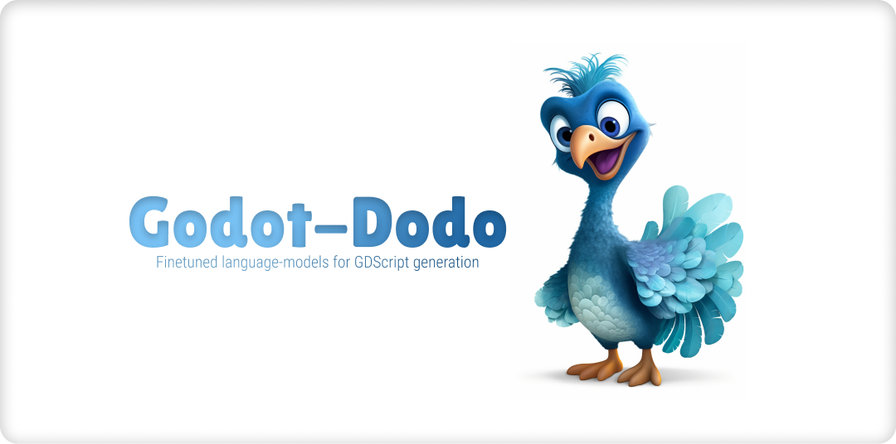
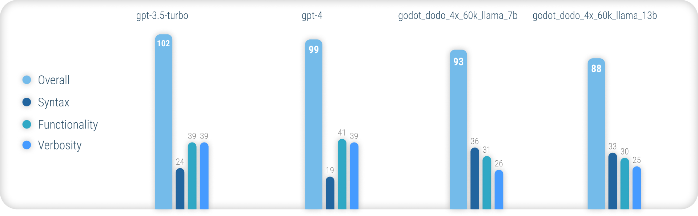

# godot-dodo



The godot-dodo project presents a pipeline to finetune open source language models on human-created, language-specific code retrieved from GitHub.

In this case, the targeted language is GDScript, but the same methodology can be applied to other languages.

This repository includes the following:

- Scripts to assemble the finetuning dataset
- Pre-assembled, raw datasets (up to a size of 60k rows)
- Scripts to finetune a model
- Links to model weights
- Performance report comparing finetuned models

## Performance



**For comprehensive results explaining the methodology used and a full list of all result, please refer to the full performance report [here](models/).**

In summary, `godot_dodo` models achieve significantly greater consistency than `gpt-4`/`gpt-3.5-turbo` when it comes to generating accurate GDScript syntax, and variants trained on code-specific base-models can even outperform them on complex instructions.

The major remaining weakpoint of this approach is the loss in appropriate verbosity when writing methods. Since human-written samples will often include references to objects initialized outside of the scope of the sample method, the model learns to do the same, resulting in cases where functionality relevant to the instruction is assumed to be already implemented. This can most likely be improved significantly by a more sophisticated dataset.

## Concept

### How?

Unlike other, similar approaches to finetuning models such as stanford-alpaca, this approach does not use existing, larger language models for the output-values of the finetuning-dataset. All code used is human-created. Language models are instead only used to **label** each code snippet.

As such, we can assemble `comment:code` data-pairs in the style of [CodeSearchNet](https://github.com/github/CodeSearchNet), making use of powerful existing models to annotate high-quality human-created code.

### Why?

Some existing language models such as `gpt-4` are excellent coders. However, a lot of their ability is concentrated in only the most popular languages, such as Python or Javascript.

Less widely used languages are underrepresented in the training data and experience a massive performance drop-off, where models routinely mistake syntax or hallucinate language features that do not exist.

This aims to provide much more robust language-specific models that can be used to reliably generate code that compiles on first try.

## Demo

To try out the pre-trained models, you can use the [inference_demo.ipynb](demo/inference_demo.ipynb) notebook.

In order to use that notebook on Google Colab, follow [this link](https://colab.research.google.com/github/minosvasilias/godot-dodo/blob/main/demo/inference_demo.ipynb).

## Dataset Generation

Due to this approach relying on human-created data, we scrape GitHub repositories using the GitHub search API.

Using the `language:gdscript` search term, we retrieve a list of repositories including GDScript code.

We also use `license:mit` to limit the dataset to suitable repositories. **Only MIT-licensed code is used for training!**

We then clone each one and apply the following logic:

- Find `project.godot` file
- Detect whether project is made for `3.x` or `4.x` Godot engine versions
- Iterate through all `.gd` files found in the repository
- For each one, split file into individual functions
- For each function found, ask existing LLM (`gpt-3.5-turbo`) for a detailed comment describing the functions purpose
- Add `instruction:response` data pair to dataset

Note that existing, human-written comments located above the code-block are not used for the `instruction` value. We are interested in consistent detail for comments, rather than trying to preserve some potentially higher-quality human-written ones.

Human comments within the code block however are preserved.

### Run

To assemble a dataset yourself, follow these instructions:

- Run `python data/generate_unlabeled_dataset.py`
- Run `python data/label_dataset.py`

Please do note that you'll need GitHub and OpenAI API keys in order to use these scripts.

## Pre-assembled datasets

Pre-assembled datasets included in this repository:

- [godot_dodo_4x_60k](data/godot_dodo_4x_60k/)
  - Assembled using `4.x` Godot projects - ~60k rows

Further datasets may be added in the future (particularly regarding `3.x` data)

## Finetuning

The fine-tuning process closely mirrors the one introduced by [stanford_alpaca](https://github.com/tatsu-lab/stanford_alpaca).

To reproduce a fine-tuned version of LLaMA, please follow the steps below.

### Hardware Requirements

In order to effectively finetune a `llama-7b` or `llama-13b` model, it is highly recommended to use at least two `A100 80GB` GPUs. You may otherwise encounter out of memory errors or experience extremely long training times, and will need to adjust the training parameters.

For finetuning `godot_dodo_4x_60k_llama_13b`, eight `A100 80GB` GPUs were used.

Another important consideration is the protocol used for GPU communication. It is recommended to use `NVLink` setups rather than `PCIe`.

Should you only have access to `PCIe` setups, please replace `full-shard` with `shard_grad_op` in the `torchrun` command. This may severely speed up your training runs at the cost of potentially higher memory usage.

### Setup

Before finetuning, make sure to install all requirements using:

```bash
pip install -r requirements.txt
```

### Run

For exact commands used for finetuning models, please refer to the individual model pages:

- [models/godot_dodo_4x_60k_llama_7b](models/godot_dodo_4x_60k_llama_7b)
- [models/godot_dodo_4x_60k_llama_13b](models/godot_dodo_4x_60k_llama_13b)

## Inference

To test out your finetuned model, you can use the `eval.py` script. Simply run:

```bash
python finetune/eval.py --model_name_or_path PATH_TO_FINETUNED_MODEL/
```

## Publishing to Huggingface

To easily upload a finetuned model to Huggingface, you can use:

```bash
python finetune/push_to_hub.py --model_name_or_path PATH_TO_FINETUNED_MODEL/ --push_name HF_MODEL_NAME --auth_token HF_ACCESS_TOKEN
```

## Finetuned model weights

Links to model weights hosted on Huggingface are provided in the respective model pages:

- [models/godot_dodo_4x_60k_llama_7b](models/godot_dodo_4x_60k_llama_7b)
- [models/godot_dodo_4x_60k_llama_13b](models/godot_dodo_4x_60k_llama_13b)

## Cost

Below the dollar-cost of assembling each available dataset and finetuning each model.

### Datasets

- [godot_dodo_4x_60k](data/godot_dodo_4x_60k/)
  - `30$` (`gpt-3.5-turbo` API costs)

### Finetuned Models

- [models/godot_dodo_4x_60k_llama_7b](models/godot_dodo_4x_60k_llama_7b)
  - `24$` (8x A100 80GB instance costs)
- [models/godot_dodo_4x_60k_llama_13b](models/godot_dodo_4x_60k_llama_13b)
  - `84$`(8x A100 80GB instance costs)

## Use with godot-copilot

Usage of finetuned models with [godot-copilot](https://github.com/minosvasilias/godot-copilot) for in-editor, fully local code generation may be supported in the future.

## Acknowledegments

Thank you to all MIT-licensed Godot projects! This would not be possible without you.

All projects that were scraped during assembly of the included finetuning data are listed in the respective dataset folders in [data](data).

Another thank you goes to [fluidstack.io](https://fluidstack.io) for their reliable, cheap GPU instances that were used for finetuning these models.

## Citation

If you wish to cite this project, please use:

```
@misc{godot-dodo,
  author = {Markus Sobkowski},
  title = {Godot-Dodo: Finetuned language models for GDScript generation},
  year = {2023},
  publisher = {GitHub},
  journal = {GitHub repository},
  howpublished = {\url{https://github.com/minosvasilias/godot-dodo}},
}
```

You should also cite the [original LLaMA paper](https://arxiv.org/abs/2302.13971) as well as [stanford-alpaca](https://github.com/tatsu-lab/stanford_alpaca).
